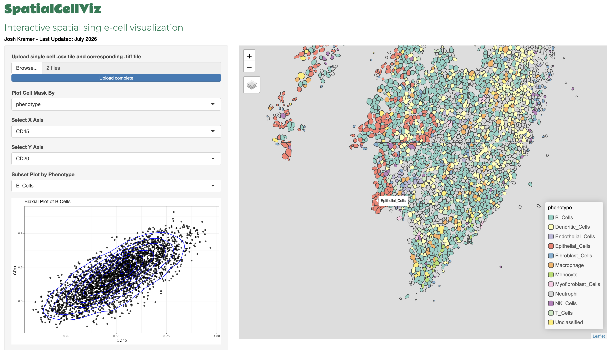

# SpatialCellViz

**An R Shiny app for visualization of spatial single-cell data with cell masks**

SpatialCellViz makes it easy to explore spatial single-cell data across an ROI (region of interest)



## Features
- Visualize spatial single-cell data for a single ROI
- Visualize cell masks
- Overlay cell phenotype, biomarker expression, or cellular neighborhoods on spatial plots
- Explore biaxial plots of biomarkers

## Inputs

SpatialCellViz accepts a CSV file containing single-cell data and its corresponding `.tiff` file (upload limit: **100 MB**)

### Required Columns

| Column          | Required? | Description                                                            |
|-----------------|-----------|------------------------------------------------------------------------|
| `phenotype`     | Yes       | Cell Phenotype                                                         |
| `cell_label`    | Yes       | Unique identifier for each cell that matches that cell in `.tiff` file |
| `cell_area`     | Yes       | Cell Area                                                              |
| `centroid_X_um` | Yes       | X coordinate for plotting                                              |
| `centroid_Y_um` | Yes       | Y coordinate for plotting                                              |
| `neigh_kmeans`  | Optional  | Cellular Spatial Neighborhood                                          |

## Running Locally

### Requirements
- R version ≥ 4.5.3
- R packages:
    - `shiny`
    - `shinymanager`
    - `sf`
    - `terra`
    - `tidyverse`
    - `data.table`
    - `tmap`
    - `plotly`
    - `leaflet`
    - `Polychrome`
    - `pals`
    - `tools`

Install the required packages in R:
```
install.packages(c(
    "shiny", "shinymanager", "sf", "terra", "tidyverse", "data.table",
    "tmap", "plotly", "leaflet", "Polychrome", "pals", "tools"
))
```

### 1. Clone the repository

```
git clone https://github.com/j0shkramer-op/SpatialCellViz.git
```

### 2. Navigate to repository

```
cd SpatialCellViz
```

### 3. Launch the app

```
shiny::runApp()
```